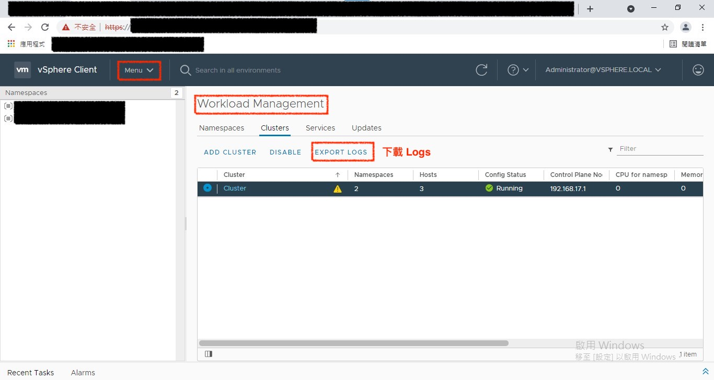

# 如何收集 Tanzu 相關問題資訊

## 1. 紀錄問題

1. 務必提供狀況描述
2. 紀錄疑似有問題的截圖、文字說明
3. 提供 YAML 檔案

## 2. 收集 Tanzu Log

請依序點選
1. 登入 vCenter
2. 點選 `Menu`
3. 點選 `Workload Management`
4. 點選 `Clusters`
5. 點選 `EXPORT LOGS`
6. 獲得 `wcp-support-bundle-domain-yyyymmdd--hh-mm.tar` 

## (Optioanl) 收集 NSX-T Log

依據 [VMware NSX-T Data Center - Collect Support Bundles](https://docs.vmware.com/en/VMware-NSX-T-Data-Center/3.1/administration/GUID-73D9AF0D-4000-4EF2-AC66-6572AD1A0B30.html) 所述

請依序點選
1. 登入 NSX Manager
2. 點選 `System`
3. 點選 `Support Bundle`
4. 選擇節點
5. 點選 `Start Bundle Collection`
6. 點選 `Download`

## 3. 提供給窗口

因 `wcp-support-bundle-domain-yyyymmdd--hh-mm.tar` 檔案很大，可採用 Google Drive / One Drive / Dropbox 放置於內，提供給代理商或原廠窗口進行偵測

## 4. 如何進行除錯?

請參考 [README-CHECK.md](README-CHECK.md) 一文
